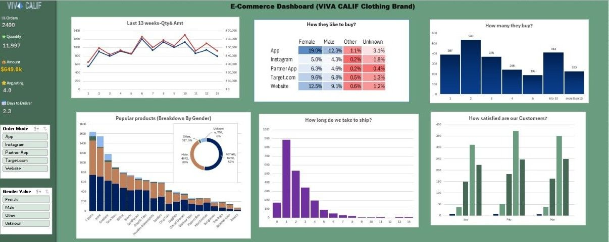

# 📊 E-Commerce Sales Dashboard (Excel)

## 📌 Project Overview

This project presents an **interactive sales dashboard built using Microsoft Excel** to analyze e-commerce business performance.

The dashboard helps visualize **sales trends, customer behavior, product popularity, and delivery performance** through interactive charts and filters.

The goal of this project is to demonstrate **data analysis and dashboard creation skills using Excel**.

---

## 🛠 Tools & Technologies

* Microsoft Excel
* Pivot Tables
* Pivot Charts
* Data Cleaning
* Data Visualization
* Interactive Filters (Slicers)

---

## 📂 Dataset Description

The dataset used in this project contains e-commerce order information such as:

* Order ID
* Product Category
* Quantity Sold
* Sales Amount
* Customer Gender
* Purchase Channel
* Delivery Duration
* Customer Ratings

This data is processed using **Pivot Tables** to generate insights for the dashboard.

---

## 📈 Key Dashboard Metrics

The dashboard highlights important business metrics including:

* **Total Orders:** 2400
* **Total Quantity Sold:** 11,997
* **Total Revenue:** $649K
* **Average Customer Rating:** 4.0
* **Average Delivery Time:** 2.3 Days

---

## 📊 Dashboard Insights

The dashboard provides insights such as:

* Sales trend for the last 13 weeks
* Customer purchase behavior across platforms
* Product popularity by gender
* Distribution of order quantities
* Shipment duration analysis
* Customer satisfaction trends

---

## 📷 Dashboard Preview

---

## 🚀 Skills Demonstrated

This project demonstrates the following data analytics skills:

* Data Cleaning & Preparation
* Pivot Table Analysis
* Business Data Visualization
* Dashboard Design
* KPI Analysis

---

## 👩‍💻 Author

**Devareddy Mayuri**
Aspiring Data Analyst
Python | SQL | Excel | Power BI | Data Visualization
